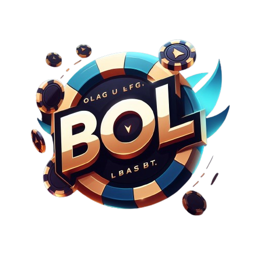

## Bet of Legends
#### Romain THOMAS, Ronan BESNARD et Kevin SOARES

Bet of Legends est un site de paris fictifs à base de points sur les matchs officiels de ligues de League of Legends.

Venez vous mettre en compétition avec d'autres fans de LoL ou avec vos amis sur notre site !

### Pour lancer le projet :

- Importer tout les fichiers dans un dossier
- Ouvrir le dossier sur VSCode ou autre
- Lancer un server de base de données (XAMPP, WAMPP, MAMPP, ...)
- Créer un .env à partir du .env.example en veillant a mettre le bon port pour la base de données
  
- Utiliser les commande dans l'invite VSCode en veillant a bien être dans le dossier du projet :
    - php artisan:key generate
    - php artisan serve
    - php artisan migrate
    - php artisan db:seed
- Cliquer sur le lien généré par la fonction 'php artisan serve'
- Accéder au site !

## License

The Laravel framework is open-sourced software licensed under the [MIT license](https://opensource.org/licenses/MIT).
